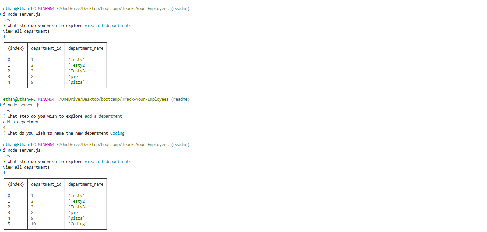
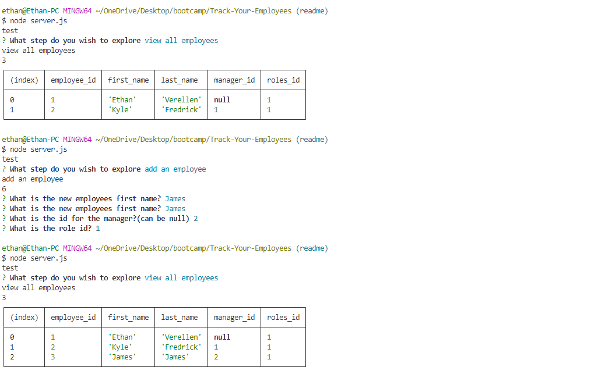

# Track-Your-Employees

by Ethan Verellen

## Table of Contents

[Description](#description)

[Useage](#useage)

[Images](#images)

[Installation](#installation)

[Tests](#tests)

[Contributors](#contributors)

[Links](#links)

[Questions](#questions)

## Description

It is a way to track those that work for you and where they work in the company.

## Useage

In order to use this project, I suggest you find it in a terminal/git and run the line npm i.  Then you should go to the /db folder and go into postgres, and run \i schema.sql.  then go back to the main folder and run node server.js.

## Images

## Installation

To install, Either download as a zip file from the repo, or git clone in gitbash or other equivelences.

## Tests

go through the steps and try all possible options

## Contributing

Ethan Verellen

## Links

https://github.com/Ethan-Verellen/Track-Your-Employees

## Questions

https://github.com/Ethan-Verellen

EthanVerellen@gmail.com

